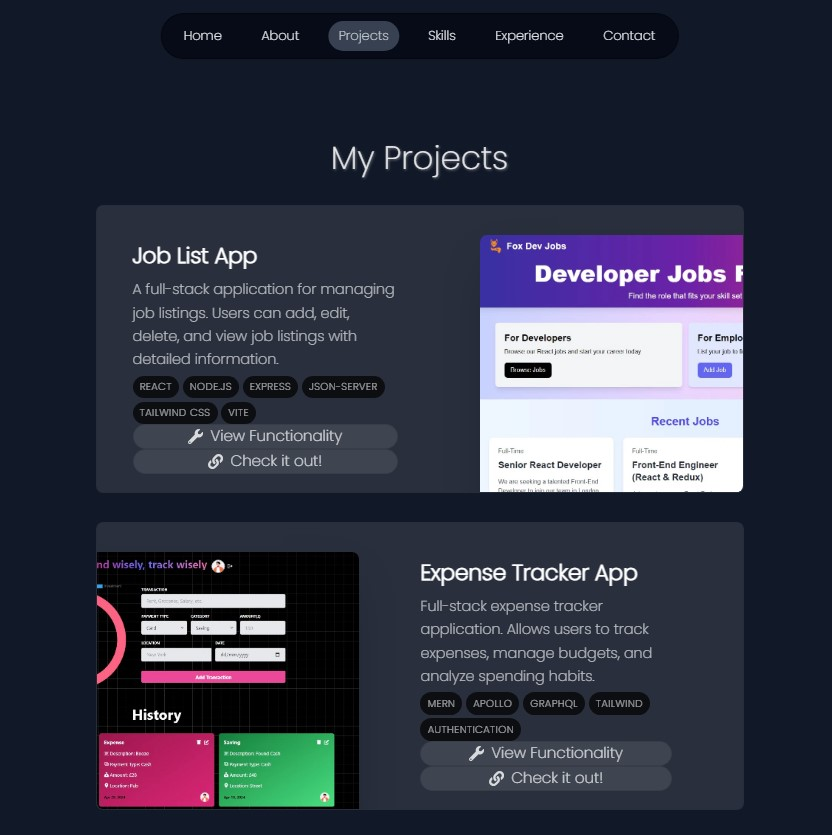
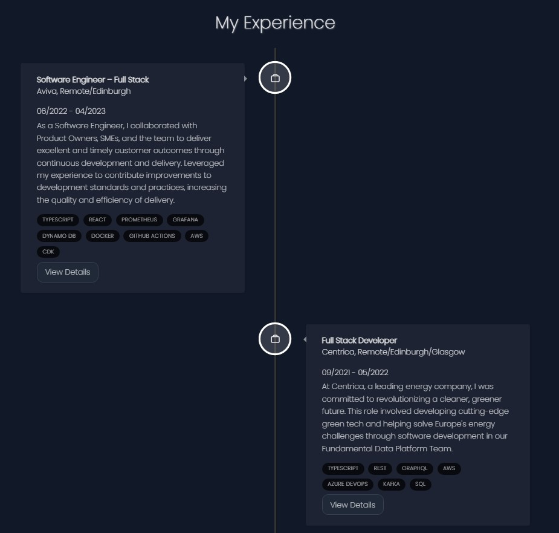

# David Fox's Portfolio

Welcome to my personal portfolio project. This project is built with **Next.js 14**, **TypeScript**, **Tailwind CSS**, **Context API**, and **Next.js Server Actions**. Below you'll find instructions on how to set up, run, and deploy the project, as well as a brief overview of the structure and key features.


## Table of Contents

- [Installation](#installation)
- [Development](#development)
- [Build](#build)
- [Deployment](#deployment)
- [Project Structure](#project-structure)
- [Features](#features)
- [Contributing](#contributing)
- [License](#license)

## Installation

1. **Clone the repository:**

    ```bash
    git clone https://github.com/maesterfox/NewPortfolio.git
    cd NewPortfolio
    ```

2. **Install dependencies:**

    ```bash
    npm install
    ```

## Development

To start the development server, run:

```bash
npm run dev
```

This will start the Next.js development server on `http://localhost:3000`.

## Build

To build the project for production, run:

```bash
npm run build
```

This command will create an optimized production build of your application.

## Deployment

To deploy the application using Vercel, run:

```bash
npm run deploy
```

Make sure you have the [Vercel CLI](https://vercel.com/docs/cli) installed and configured.

## Project Structure

Here's a brief overview of the project's structure:

```
.
├── components
│   ├── Header.tsx
│   ├── Footer.tsx
│   └── ...
├── context
│   ├── AuthContext.tsx
│   └── ...
├── pages
│   ├── _app.tsx
│   ├── index.tsx
│   └── ...
├── public
│   └── images
├── styles
│   ├── globals.css
│   └── ...
├── utils
│   └── ...
├── .eslintrc.json
├── next.config.js
├── package.json
├── tailwind.config.js
└── tsconfig.json
```

### Key Files and Directories

- **components/**: Contains reusable React components.
- **context/**: Contains Context API related files for state management.
- **pages/**: Contains the page components as per Next.js conventions.
- **public/**: Contains static assets such as images.
- **styles/**: Contains global and component-specific styles using Tailwind CSS.
- **utils/**: Contains utility functions and helpers.

## Features

- **Next.js 14**: Utilizes the latest features of Next.js for optimal performance and developer experience.
- **TypeScript**: Ensures type safety and code quality.
- **Tailwind CSS**: Provides utility-first CSS for rapid UI development.
- **Context API**: Manages global state efficiently.
- **Server Actions**: Leverages Next.js server-side capabilities for improved performance and security.

 



## Contributing

Contributions are welcome! If you have any ideas, suggestions, or issues, please feel free to open an issue or create a pull request.

1. Fork the repository.
2. Create a new branch.
3. Make your changes.
4. Submit a pull request.

## License

This project is licensed under the MIT License. See the [LICENSE](LICENSE) file for details.

---

Thank you for checking out my portfolio! If you have any questions or feedback, feel free to reach out.
